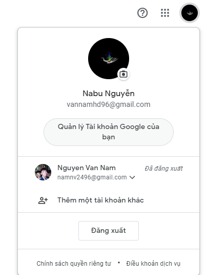
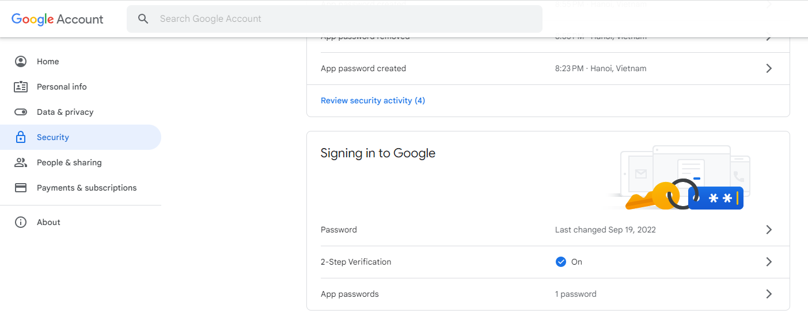
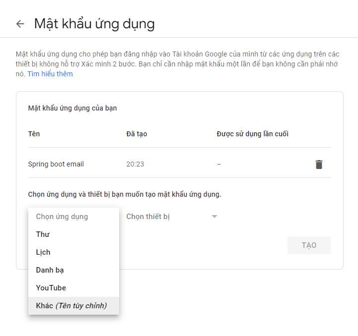
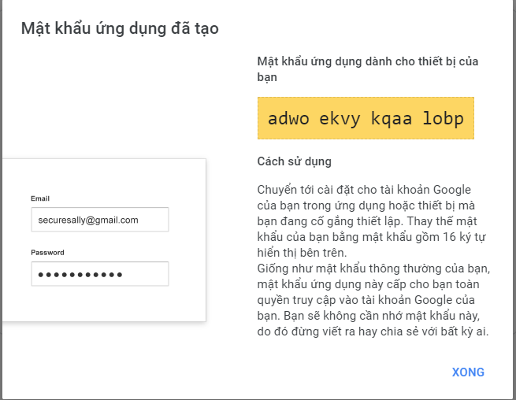
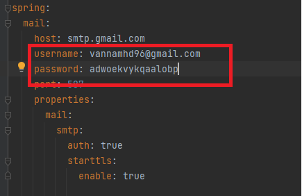
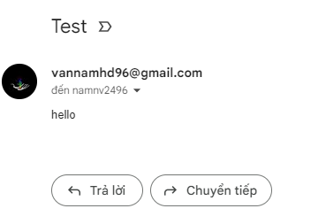

# send Email through gmail via SMTP

    // access
    https://myaccount.google.com/security

create new app password to create password

    // CURL
    curl --location --request GET 'http://localhost:8080/send' \
    --header 'Content-Type: application/json' \
    --data-raw '{
    "recipient": "asfsd",
    "msgBody": "hello",
    "subject": "Test"
    }'

Result

